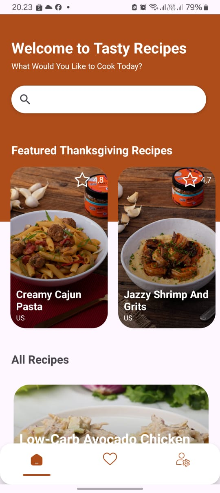
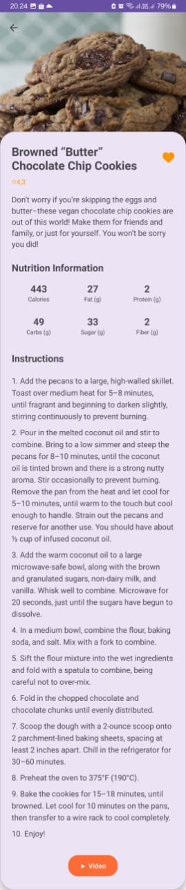
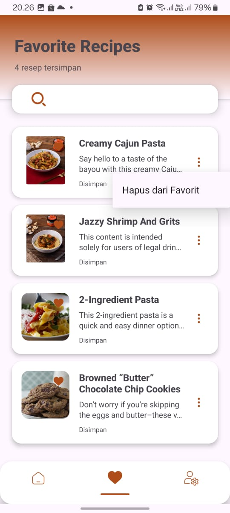
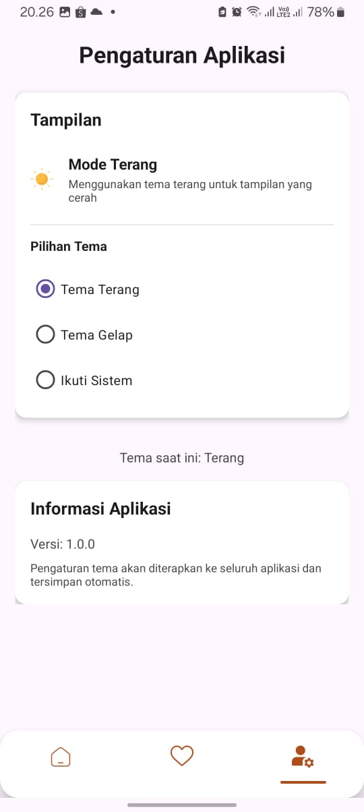

# 🍔 Tasty-Food-Mobile-App – Nikmati Resep Dari Platform Terbaik

Android | Java | SQLite | API Integration | RecyclerView | Navigation Component

> **“Ketika Dunia Kuliner Bertemu Teknologi”**

Tasty Food Mobile App adalah aplikasi Android berbasis Java yang membawa pengalaman baru dalam menjelajahi dunia masakan. Aplikasi ini memberikan akses mudah ke ratusan resep populer dari akun-akun ternama, 
dilengkapi fitur penyimpanan offline, rekomendasi cerdas, serta antarmuka yang ramah pengguna.

---

## 📋 Daftar Isi

1. [🎯 Tentang Proyek](#-tentang-proyek)
2. [✨ Fitur Utama](#-fitur-utama)
3. [📱 Tampilan Aplikasi](#-tampilan-aplikasi)
4. [🛠️ Implementasi Teknis](#-implementasi-teknis)
5. [🧱 Teknologi yang Digunakan](#-teknologi-yang-digunakan)
6. [📚 Cara Memulai](#-cara-memulai)
7. [📝 Lisensi](#-lisensi)

---

## 🎯 Tentang Proyek

**Tasty Food Mobile App** lahir dari kebutuhan akan platform digital yang memudahkan pengguna mengeksplorasi resep dari influencer kuliner terpercaya. Aplikasi ini bukan hanya menjadi kumpulan resep, tapi juga alat bantu bagi siapa saja yang ingin belajar masak dengan cara yang menyenangkan dan personal.

### Masalah yang Diselesaikan
- Sulitnya mencari resep autentik dan teruji  
- Kurangnya fitur penyimpanan lokal  
- Ketergantungan pada koneksi internet  
- Minimnya personalisasi dan rekomendasi  

### Solusi
Aplikasi ini menyediakan:
- Akses ke ratusan resep dari akun populer melalui API resmi  
- Fitur simpan resep favorit secara lokal  
- Rekomendasi berdasarkan rating tinggi  
- Antarmuka intuitif yang bisa diakses bahkan tanpa internet  

---

## ✨ Fitur Utama

| 🔧 Fitur | 📌 Deskripsi |
|--------|-------------|
| 📺 Detail Video | Setiap resep dilengkapi video tutorial langsung dari sumber asli |
| ❤️ Simpan Favorit | Gunakan SQLite untuk menyimpan resep kesukaan secara offline |
| 🔁 Refresh Data | Tombol refresh untuk reload data saat gagal mengambil dari server |
| 📡 Rekomendasi Cerdas | Menampilkan resep berdasarkan rating tertinggi |
| 🌗 Tema Gelap/Terang | Toggle tema menggunakan SharedPreferences |
| 📋 Navigasi Fragment | 3 tab navigasi: Beranda, Favorit, Pengaturan |

---

## 📱 Tampilan Aplikasi

Berikut adalah screenshot dari halaman utama aplikasi:




Berikut adalah screenshot dari detail resep padaaplikasi:



Berikut adalah screenshot dari halaman list resep favorit aplikasi:



Berikut adalah screenshot dari halaman setting aplikasi:



## 🛠️ Implementasi Teknis

Aplikasi ini dikembangkan dengan pendekatan modular dan clean architecture sederhana menggunakan **Java** sebagai bahasa utama dan **Android Studio** sebagai IDE. Berikut adalah beberapa komponen penting yang digunakan:

### 🔄 Intent & Activity
- Digunakan untuk berpindah antar halaman (MainActivity → DetailActivity)  
- Mengirimkan data resep menggunakan `Intent.putExtra()`  

### 📋 RecyclerView
- Digunakan untuk menampilkan daftar resep secara dinamis  
- Adapter dirancang untuk binding data dari API  

### 🧩 Fragment & Navigation Component
- Terdapat 3 fragment: HomeFragment, FavoriteFragment, SettingsFragment  
- Diintegrasikan dengan BottomNavigationView  

### 🧵 Background Thread
- Semua operasi jaringan dan pencarian dilakukan di thread background  
- Mencegah UI freeze selama proses loading  

### 🌐 Networking
- Menggunakan API resmi dari **Tasty** via RapidAPI:  
  [https://rapidapi.com/apidojo/api/tasty](https://rapidapi.com/apidojo/api/tasty)  
- Penanganan error jaringan lengkap  
- Tombol refresh jika koneksi bermasalah  

### 💾 Local Data Persistence
- **SQLite Database** digunakan untuk menyimpan resep favorit  
- **SharedPreferences** digunakan untuk menyimpan preferensi tema  

---

## 🧱 Teknologi yang Digunakan

| Teknologi | Fungsi |
|----------|--------|
| Java | Bahasa pemrograman utama |
| Android Studio | Lingkungan pengembangan |
| RecyclerView | Menampilkan daftar resep |
| Retrofit | Untuk request API |
| SQLite | Menyimpan resep favorit |
| SharedPreferences | Menyimpan preferensi user terhadap dark atau light theme |
| BottomNavigationView | Navigasi antar-fragment |

---

## 📚 Cara Memulai

### Prasyarat
- Android Studio (versi terbaru)
- JDK 8
- Perangkat fisik atau emulator Android
- Koneksi internet (opsional untuk mode offline)

### Instalasi
```bash
git clone https://github.com/alifsarezkyrahmah/Tasty-Food-Mobile-App.git
```

1. Buka project di Android Studio  
2. Sync Gradle  
3. Jalankan aplikasi  

### Konfigurasi
- Jika menggunakan API key, pastikan sudah dimasukkan di `NetworkUtils.java`  
- Sesuaikan endpoint API sesuai kebutuhan  

---

## 📝 Lisensi

Dilisensi di bawah MIT License – lihat file `LICENSE` untuk detail lebih lanjut.

---


> Oleh: Alifsa Rezky Rahmah Sabran  
> Email: alifsarezkyrahma@gmail.com
> Instagram: @alifsarr2

---

